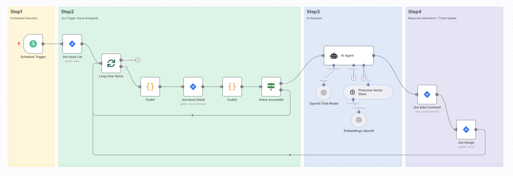

# Jira Knowledge Sync Minimal (Summary, Comment, Assignee)
15–30分で導入できる、LLMを使った **Jira 自動更新ワークフロー（n8n）**。  

## Quickstart
- n8nのWorkflow画面右上「…」→ **Import from file** → `Jira_Knowledge-Sync-Minimal-Summary-Comment-Assignee.json` をインポート
- ノードの「!」が消えるまで **認証** を設定（**Jira / OpenAI / Pinecone**）
- 次のノード内の `＜アカウントIDを入力してください＞` を **JiraのLLM専用アカウントID** に置換  
  - **Jira Issue List**  
  - **check accountId**
- 画面下部の **Execute workflow** でテスト  
  **成功条件**：対象Issueに**要約コメント**が追加され、**担当者**が最新コメントのユーザーへ変更される

## 必要要件
- n8n（Self-Hosted / Cloud いずれも可）
- APIキー：**Jira**（Base URL / Email / API Token）、**OpenAI**（API Key / Model）、**Pinecone**（API Key / Index / Project）
- **Jira LLM専用アカウント**

## セットアップ（任意の詳細）
- n8nインストール（Docker Compose 例）：公式ドキュメント参照  
  https://docs.n8n.io/hosting/installation/server-setups/docker-compose/#5-create-local-files-directory

## 使い方
1. ワークフローを開く → ノードの警告「!」をすべて解消  
   - **OpenAI Embeddings** の **Dimensions** は **Pinecone Index** の設定と一致させる  
   - **Jira** 認証は対象サイトの **Base URL** と **Email+API Token** を設定  
2. **Execute workflow** でテスト→ Jira の該当Issueに **コメント** が投稿され、**担当者** が最新コメントのユーザーへ変更されます

## その他

改善提案やバグ報告は、GitHubのIssuesまたはPull Requestでお願いします。
